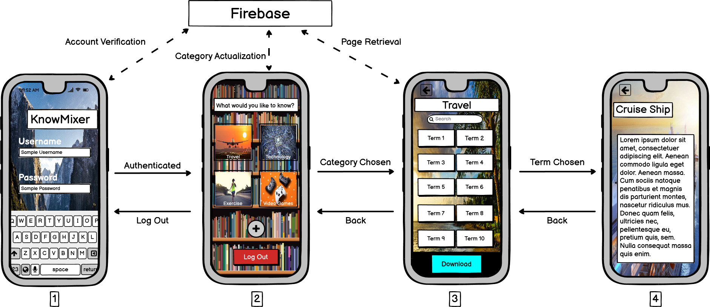
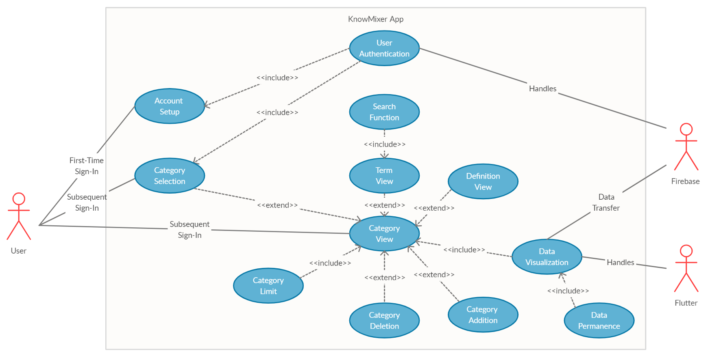
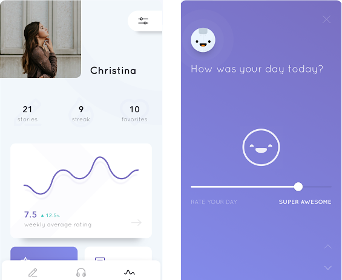
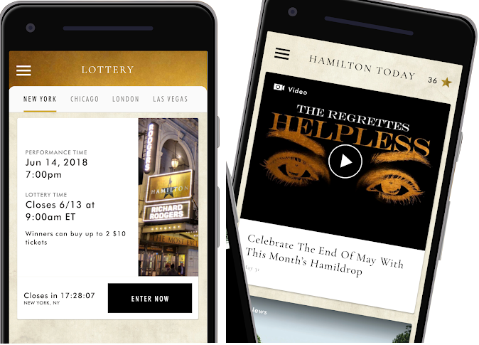

Christopher Duarte
 
 September 17, 2020 

 
 
 

<h1 align = center>KnowMixer Application Design Document</h1>

## Introduction
KnowMixer is a mobile digital encyclopedia application utilizing Flutter for frontend user interaction, and Firebase for storing user authentication data and encyclopedia datastore. This design document seeks to illustrate *how* both segments of the application come together to function under realworld use. Additional topics will be discussed such as the importance of offline functionality, how each element of the app comes together under a Use Case Diagram, and why Flutter and Firebase were chosen over alternatives to realize the purpose of KnowMixer. 

## Solution Approach (High Level)
The inspiration behind KnowMixer came with having the need for easily accessible information at the grasp of a user's fingertips, without the requirement of having an internet connection. The general usage of the KnowMixer Application works in the following way:
1. User opens KnowMixer to arrive at a startup log in screen.
2. User inputs username and password credentials to be authenticated by Firebase Authentication.
3. After being authenticated, user is brought to an encyclopedia category page (which will initially be empty). From here, the user will be able to select from a catalogue of existing categories which he/she is interested in to look at available terms, decide to add additional category, or log out.
4. Upon selecting a category, a page retrieval request is sent to Firebase Firestore from which a page is brought to the frontend KnowMixer application with the terms contained within that category. When complete, the user is brought to a scrollable view screen of all the available terms for the selected category. From here, the user can select the term for which they want to know more about.
    - In the category page, if the user would like to have an encyclopedia category available for offline use (without page retrieval request). Then, a download button will be available on the bottom portion of the screen which, upon press, will trigger the process of copying all terms from the datastore to the local KnowMixer application. As a result, page retrieval requests will no longer be necessary, allowing the application to work offline in regards to the chosen downloaded category. 
5. When the term is selected, the user is brought to a definition page where the term is presented on the top bar of the screen and the scrollable definition is provided below it. 

Throughout the application, relevant background graphics are utilized to illustrate where the user is located in the application. For example, having a bookshelf image to illustrate the categories page or tennis ball image to connect with a possible tennis ball definition being presented. 

An Illustration of a basic interaction in KnowMixer is as follows:

    

<i>Figure 1</i>

From *Figure 1*, Screen 1 is the front end user authentication screen that the user sees upon starting the application. He/She will then be prompted to enter a username and password to be authenticated by Firebase Authentication. If the given data is valid, the user is brought to Screen 2. Now, if the user is offline and has previously logged in, the user will be brought straight to the category page (Screen 2) but will be feature limited (won't be able to access certain features of the application). Feature limited actions include not being able to add additional categories and not being able to retrieve pages that have not been downloaded (both need access to Firebase Firestore). 

Assuming the user is able to communicate with the datastore, if he/she selects to add an additional category, they will be brought to a page similar to Screen 2 which illustrates **ALL** possible encyclopedia categories available for the Firebase Firestore. For the sake of efficiency, this will be a scrollable view page only displaying the titles of the encyclopedia pages to be added to Screen 2 of the local application. The difference between these two pages is that once an encyclopedia page is available on Screen 2 it is now marked as preferred by the user and he/she can now access the category for terms and definitions. 

Assuming the user has chosen a category, Screen 3 is demonstrated with the category title, search bar feature, and all terms in the encyclopedia page visible through an scrollable view. In addition, he/she may desire to keep a category for future offline use. If so, then the user can download the category via the download button available at the bottom of the screen. From here, the user can select a term and will be brought to Screen 4 which displays the term as a title in the top bar with the definition below. To exit the application the user can back out from both Screen 3 and 4 to arrive at Screen 2 from which he/she can simply log out. 

This illustrates the basic transaction that the KnowMixer application accomplishes, but additional features can be implemented in the future. For example, for a particular term like cruise ships, upon scrolling down, cruise deals and other options related to cruise ships may be available for purchase through companies like Expedia. This is simply a possible additional feature and does not detract from the main purpose of KnowMixer which is first and foremost to serve as an offline encyclopedia app. 

## Analysis Approach 
There are several questions that must be addressed in order for the KnowMixer app to function properly:
1. How does utilizing the Flutter UI toolkit developed by Google contribute towards the construction and functionality of KnowMixer?
2. How does Firebase work? How is it able to do both user authentication and serve as a datastore? Furthermore, how will the category and term definitions be stored? Will the data be received by the user in realtime or through fetch requests?
3. Where will the data for the encyclopedia pages be obtained from?
4. Once basic app functionality is established, how will the KnowMixer application be able to function offline (without Firebase datastore reachability/access)?
### Flutter
Flutter is Google's UI toolkit for building frontend natively compiled applications for mobile platforms utilizing a single codebase. This means that once the application is constructed using Google's programming language, Dart, it is ready to be deployed on both Android and iOS. There is no need to construct two applications for each individual platform as Flutter handles the building of the application in each respective platform. 

If Flutter development is to be summarized in one phrase, it is that '**everything is a widget**'. Applications in Flutter are constructed using a structure called a **Widget Tree** which represents how widgets are organized in the application. For those familiar with web development, as web pages have a **DOM** Flutter has a **Widget Tree**. 

An example widget tree for a shopping cart application is as follows:

    

<i>Figure 2</i>

- MyApp - root widget. All Flutter Applications start at this point in the Widget Tree.
- MyLoginScreen - initial screen for the application.
- MyCatalog - list of products with an app bar to allow user to access cart.
- MyCart - when user chooses a product, it is added to cart.

In comparison to the KnowMixer widget tree, the shopping cart widget tree is simple and small. But, with the addition of Flutter's [Widget Catalog](https://flutter.dev/docs/development/ui/widgets), Flutter empowers application developers to create beautiful and versatile apps with minimal code. 

In relation to KnowMixer as seen in *Figure 1*, this means:
1. Being able to enter the application through the root widget upon startup. 
2. Navigating to Screen 1 and placing all the widgets with their respective attributes onto the screen due to Flutter's declarative UI methodology (similar to a WYSIWYG fashion).
3. Repeating Step 2 with Screens 3 and 4. 

Of course, there will be differences in the subtree of each widget page as each one requires different widgets based on the functionality of the application. But, it does not detract that Flutter enables the developer to make these changes in an easily programmable fashion, and without negatively affecting the running of the application. 

### Firebase
Firebase, as a whole, is a backend tool suite and service provided by Google that handles the backend infrastructure of many modern applications. The main benefit that Firebase offers for  KnowMixer is that it is reliable (backed by Google), scalable (no need for monetization for small apps), and is known to work well with Flutter applications (both toolkits supported by Google). Because both Flutter and Firebase collaborate together and are actively maintained, applications designed with Flutter and supported through Firebase appear to work seamlessly. 

In relation to the KnowMixer application, Firebase offers Authentication and Firestore features. 

Authentication would initially only involve an email and password combination but will be extended in the future due to the more versatile login options that Firebase provides. These include utilizing Google, Facebook, and Twitter login credentials for KnowMixer access. 

A crucial function that the KnowMixer app must accomplish, through its backend, is storing and retrieving encyclopedia terms and definitions in a category for the user to obtain. In addition to the cloud infrastructure that Firebase offers in having this information readily available, the Firebase Firestore has an adaptable manner of storing categories and terms as collections and documents. 

Documents are similar to Javascript objects which contain key value pairs which can store a variety of objects like strings, numbers, and booleans (essentially maps). Collections are objects that contain a collection of only document type objects. The 'rule' for how this infrastructure works is that a collection can contain documents which can point to sub-collections which in turn contain more documents which can point to other sub-collections. In the end, the infrastructure may alternate between collections and document objects creating a nested structure, but documents will never contain other documents and collections cannot contain other collections. These two object types will alternate between each other. This is viable through Firebase Firestore due to 'shallow queries' which means that you will **only** fetch the data based on the query you made at that level of the tree, any other data from child document or collection objects will not be obtained. 

Another key aspect of Firebase Firestore is the tree-like structure that is adopted between the firebase root of the firestore and its collections. All firestores begin with a root and link with child collections. For KnowMixer, these initial child collections **are** the categories for the encyclopedia data. The documents stored in these collections are then the terms with the only key-value pair (field) contained being the definition of the term. Thus, the documents (terms) for the desired collection (category) will be fetched upon arriving to Screen 3 of *Figure 1* and the field of the corresponding document (term) will be displayed on Screen 4. Firestore in both cases has the option of having real-time snapshots of the data available, but the data will be fetched instead. This is to maintain a sense of stability when utilizing the application in regards to the user. If the definition or term is modified while a user is on Screen 3 or 4, he/she will see the changes in real-time when using snapshot. By fetching, the data is kept on the page, for the time being, and will only change when the user fetches again (goes to Screen 3 or 4 of the application). As a result, the user will be not be aware of the most recent changes but overall app stability and usability is maintained. 

### Encyclopedia Data
The encyclopedia data will obtained from [Encyclopedia Britannica](https://www.britannica.com/) and will be credited in the appropriate manner at the bottom of each term page. This does not detract from the work required in transcribing the data from the encyclopedia to the appropriate manner as described [above](###Firebase). But, nonetheless, the information provided in Encyclopedia Britannica is both accredited and a valuable assistance in collecting the necessary resources in being able to provide the required data for an offline encyclopedia application like KnowMixer.

### Offline Storage
Due to a lack of communication with the Firebase Datastore, certain aspects of the KnowMixer application will be missing/inaccessible. For example, being able to add prexisting categories and retrieving the available terms in those categories, if they were not previously downloaded. But once the collection and its ensuing documents are downloaded, the terms and data will be available locally for the user at any time. By downloading an entire collection of terms, KnowMixer becomes "heavier" by saving more data locally but will become more permanent than just saving it to cache. KnowMixer will save this data locally upon download by fetching the data from the Firestore and storing it locally with Flutter data types/objects. In this manner, the user will have access to their desired information at a moments notice from anywhere at anytime. 

## Use Cases Design 
### KnowMixer Use Case Diagram

    

<i>Figure 3</i>

Based on the KnowMixer Use Case Diagram, there are both Functional and Non-Functional Requirements that must be addressed in regards to the application.

\**Note*: Main points are the functional requirements and sub-points are the non-functional requirements. 
### KnowMixer Requirements
1. **Account Setup**: Once a user sets up an account locally, data must be relayed to Firebase Authentication to allow the user to subsequently access additional KnowMixer features.
    - *Account Authentication Update*: Firebase should verify and create accounts in a timely manner with the appropriate account credential data. If the process is interrupted or credentials don't match, user should be notified that the action they were trying to perform could not be completed. 
2. **Category Selection**: Upon making an initial account, user must be prompted to select the encyclopedia categories from which they'd like to see. This will then be visible in the Category View. 
    - *Category Catalogue Presentation*: The manner in which the available categories in the Firebase Firestore are presented must be inobtrusive and accessible. A category really opens up and looks presentable on the KnowMixer Category View, not in the category catalogue of the Firestore. This is because there may be many encyclopedia collections present in the Firestore and will be summarized only using text. 
3. **User Authentication**: Firebase Authentication is responsible for verifying user credentials and account existence. If login data is valid and the account exists, user will be allowed to access additional KnowMixer features related to his/her account. Otherwise, the user is locked out of the system. 
    - Refer to *Account Authentication Update* under Account Setup. 
4. **Category View**: After going through Category Selection, all selected encyclopedia categories will be visible through the category view/screen. This view serves a nexus for the rest of the KnowMixer Application.
    - *Category View Presentation & Update*: Unlike *Category Catalogue Presentation*, the presentation of the category view must be elegant and neat as a derivative of Flutter design. This includes having photos and minimalistic features on each category option in the category view. In addition, the load times for the category view (view of all categories) must be completed in approximatley 30 seconds. 
5. **Term View**: An extension of the Category View from which all terms related to an encyclopedia category can be viewed, when a category is selected. 
    - *Term Update*: The page retrieval and load time for the term view must be completed in approximately 30 seconds. 
6. **Definition View**: An extension of the Category View from which the definition of a particular term can be seen. This will be accessible through the Term View but would not be possible without the Category View from which it originated.
    - *Definition Update*: Load time for the definition view must be completed in approximately 30 seconds. 
7. **Search Function**: An important feature for the KnowMixer application, especially when searching through an Encyclopedia with many terms in the Term View. A simple and efficient algorithm for searching through sorted data (like an encyclopedia) would be binary search. If by some manner the data is not sorted/organized for the encyclopedia, an implementation of heapsort can be used to deal with the large amount of terms and then fed to binary search. The end result will allow the user to select the term they wanted if it exists in the encyclopedia and be brought to the Definition View. 
    - *Search Presentation & Update*: Search Bar/Function must show the ten nearest word approximations based on the inputted characters already in the search input field. Final/Actual search result must be completed within 15 seconds. 
8. **Category Limit**: Based on memory constraints of the application, there should be a limit of approximately 10 categories for KnowMixer that a user can download. This can be later modified to simply allow the user to add as many categories as desired based on hardware limitations. 
    - *Category Limit Notification*: When the user is encroaching the limit of the number of available categories, a mobile popup alert must be shown to notify the user that the capacity of available categories that can be downloaded has been reached.  
9.  **Category Deletion**: If a user does not want to keep a particular category on KnowMixer, he/she may delete it in the category view. The category will still be available in the Firebase Firestore but will not be viewable locally for the user on the KnowMixer app. 
    - *Deletion Update*: The entire process for the deletion of a category from the KnowMixer app should not take longer than 30 seconds. 
10. **Category Addition**: If a user wants to have additional encyclopedia categories, he/she may select to do so in the category view. From there, he/she will be brought to the category selection screen from which additional categories (that have not already been chosen) can be added. 
    - *Addition Update*: After the user has selected the category to be added, the process of adding the category to the category view should take no longer than 30 seconds. 
11. **Data Visualization**: For the category view, term view, and definition view, there is data that must be displayed to the user in relation to encyclopedia data. This data originates from pre-existing pages on the Firebase Firestore and will be visualized/handled by Flutter. 
12. **Data Permanence**: As part of data retrieval and visualization process for KnowMixer, there must be a way of saving the retrieved data locally for the user to access on their own accord offline. 

## Database Design
Due to nature of how the Firebase Firestore functions, the process of desigining, creating, and maintaining a database has been abstracted away. Now, only the data that is to be presented to the user must be established and maintained through collection and document objects available in the Firestore. This was covered in a [previous section](#firebase).

## UI Design
One of the main aspects for choosing to use Flutter as opposed to other [tools](#technology-choice) is that Flutter enables a fast turn out rate in the creation of applications with beatiful UIs and a versatile collection of widgets which enable the developer to create varied and innovative products.

To demonstrate the versatility of Flutter in the creation of applications, it is possible to create an application similar to the one demonstrated in *Figure 1* utilizing Python's Tkinter GUI package, but it wouldn't look as presentable as Flutter's inherent material design for applications.

Examples of applications that utilize Flutter are as follows:
- Alibaba (eCommerce)

    

<i>Figure 4</i>

- Reflectly (Lifestyle)

    

<i>Figure 5</i>

- Hamilton Musical (Entertainment)

    

<i>Figure 6</i>

Thus, instead of using Flutter to create a generic encyclopedia application that has been made in the past, it enables the developer to construct a memorable app that is unique and beautiful, similar to the samples provided above. This in combination with Firebase allows for an app that enables the user to search for desired terms and information at a moment's notice through offline functionality. 

This is not to say that the final application **can't** look like that in *Figure 1*, but **instead** it will naturally look better due to Flutter's material design. 
## Prototype
It is expected that a prototype of the KnowMixer application will be presented with final submission of this design document. The prototype will have basic functionality which includes having the basic workflow of the application working locally with Flutter and having the Firebase Authentication and Firestore features working with dummy data and accounts. In this manner, it is possible to see if KnowMixer can handle real-world use as both an offline and online encyclopedia app. 

## Technology Choice
At this point, it has been [explained](#analysis-approach) why Flutter and Firebase work well with the [purpose](#solution-approach-high-level) the KnowMixer app seeks to accomplish.

But what are other alternatives that serve as both a frontend and backend to modern applications that could have been used for the KnowMixer application?

Example Alternatives to Flutter:
- React Native
- NativeScript
- Ionic
- Xamarin

Example Alternatives to Firebase:
- Back4App
- Parse
- AWS Amplify
- Firehose

Besides both being Google products which ensures reliability and minimal cross compatibility issues, I've previously worked on an application involving Flutter and Firebase. Thus, there exists a preference towards these two versus the other viable alternatives listed for both frontend and backend design.  
## Conclusion
The main objective that the KnowMixer app hopes to accomplish is to provide readily accessible data in the hands of the user at all time. To this end, KnowMixer should function in both an offline and online fashion to accomodate this goal. The front end implementation will be constructed using the UI toolkit Flutter and the backend infrastructure will be handled by Firebase. Both product are being actively maintained by Google, meaning there should not be an issue in "future proofing" the KnowMixer app.

Upon analysis, it appears that the way data storage is implemented in Firebase Firestore, in terms of collections and documents, readily accomodates for the storage of encyclopedia categories and terms needed for KnowMixer. In this manner, it will be simple to store the necessary data in an online fashion and make it easily portable locally in an offline mode. 

Although the KnowMixer app could be created using many diverse frontend and backend options, it appears that Flutter and Firebase are the definitive option to create the desired encyclopedia app. Due to these tools, the final product will naturally be fast, sleek, gorgeous, and readily provide the user with his/her desired information at a moment's notice.

## References
- https://flutter.dev/docs/development/ui/widgets
- https://dev.to/rubensdemelo/flutter-widget-tree-and-state-management-31an#:~:text=In%20Flutter%2C%20everything%20is%20a,the%20state%20of%20the%20app.
- https://www.slant.co/options/17635/alternatives/~flutter-alternatives
- https://blog.back4app.com/best-firebase-alternatives/
- https://insights.daffodilsw.com/blog/10-amazing-apps-built-using-flutter-framework
- https://www.britannica.com/
- https://firebase.google.com/